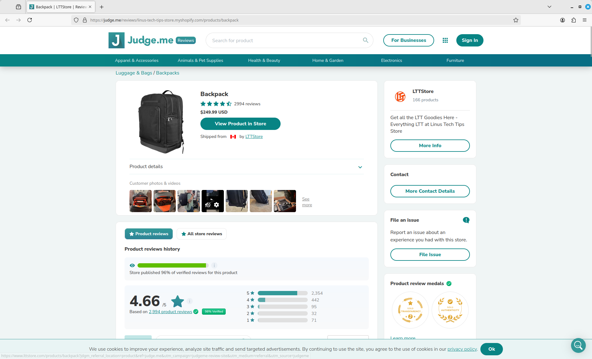
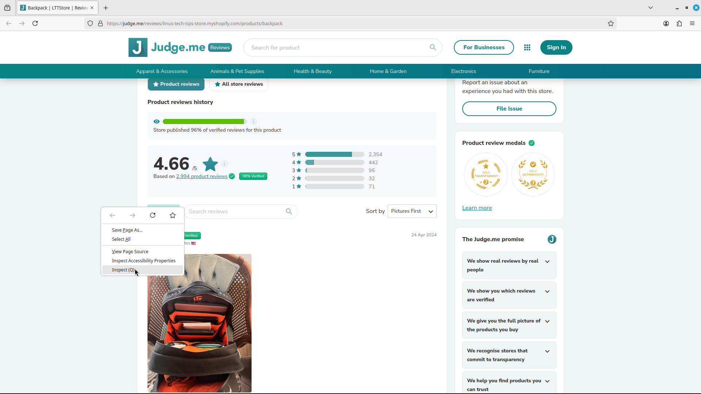
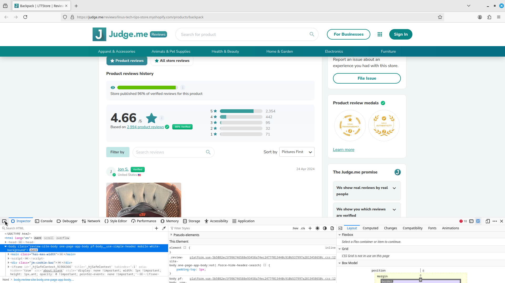
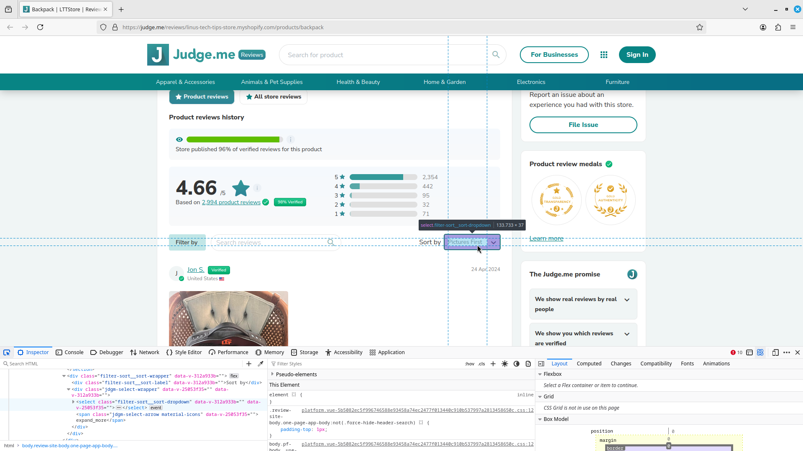
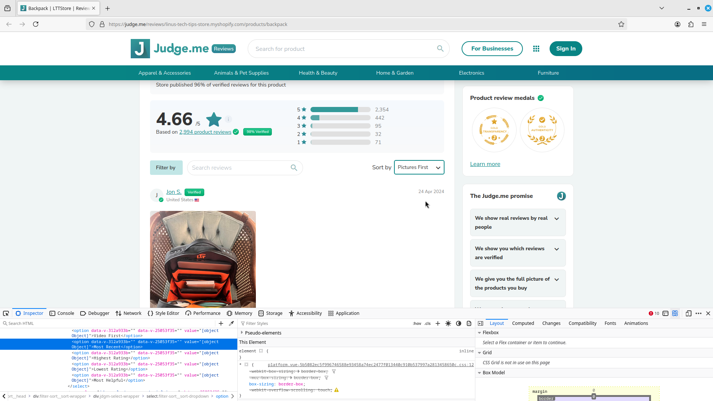
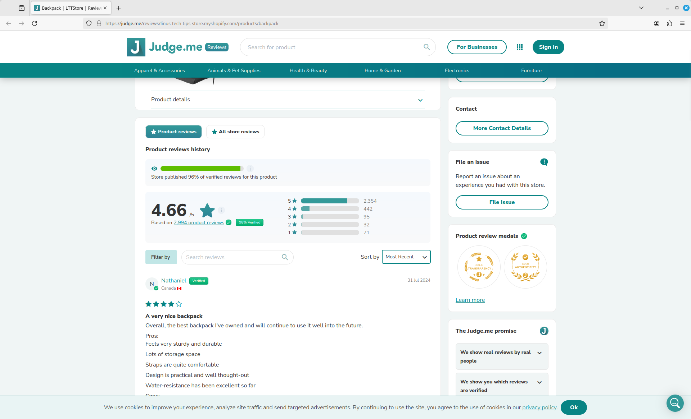
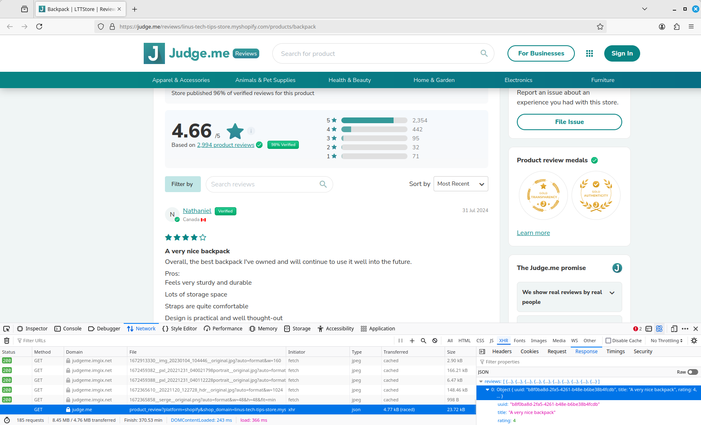

# 2024-08-18
## Overall Progress
1. Create github repo and project name
2. Create developer environment (using setup from dev-onboarding)
3. Find review source, start collecting reviews

## Find review source
- LTT Store's customer reviews are handled by judge.me, previously the reviews would be embedded on the product page
- Let's start with the backpack's reviews [direct link](https://judge.me/reviews/linus-tech-tips-store.myshopify.com/products/backpack) in a notebook
- I got a error ` could not initialize webview error could not register service worker`
  - This stackoverflow solution resolved it ["Error loading webview: Error: Could not register service workers: TypeError: Failed to register a ServiceWorker for scope"](https://stackoverflow.com/a/69316961)
- launching the playwright browser and loading the page
  - 
- launching the inspector
  - 
- selecting a element
  - 
- selecting the review dropdown
  - 
  - 
  - 
- getting the reviews graph api request
  - 
- I made the pivot to focus on development and write the guide later because writing the guide was slowing down my development
- Encountered some issues with playwright, at page 50 the network would time out and stop collecting reviews. The solution was to use requests and make a get request.